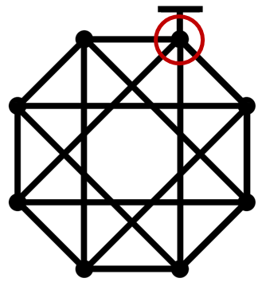

# Algorithm

 Using properties of Eulerian circuit, this algorithm can be used for any Eulerian circuit, not only this project’s map. It is simple because Eulerian circuit is closed and every vertex has an even number of edges. By using these properties, if there is a path entering a vertex, there must be an exit path. So, in Eulerian circuit, as long as the algorithm follows certain rules, it will definitely return to the starting point with a Eulerian trail.

 The map is stored only by the number of vertices and the number of edges, without vertex connection information. Based on the memorized map information, if the certain rule is repeated as many times as the number of vertices, change the rule to pass through another edges and end when it has moved as many times as the number of edges. Then it can be arrived by a one-stroke route (Eulerian trail) at the starting point.

# Phase1

Figure 1

|  |  |  |
|:-----------------------------------:|:---------------------------------------------------------------:|:-----------------------------------:|
| Figure 2                            | Figure 3 - start line will be ignored                            | Figure 4                            |

 In phase 1, memorize the map to save the number of vertices and the number of edges.

 The robot rotates 360 degrees at each vertex, finds how any edges there are in that vertex using IR sensor, and counts the total number of vertices and the total number of edges.

 If the starting point (Figure 1), the robot finds an odd number of edges because of start line. Then the robot recognizes this as the start vertex, and the same applies to the end vertex.

 Because the Eulerian circuit is closed, the robot can visit all vertices by moving along the edge, which is the line furthest to the right based on the current position, it is the line that is first recognized at number 0 of the IR sensor (marked in Figure 2) when turned to the left. Figure 3 and Figure 4 is the examples show the order in which the lines are recognized.

 So, if phase 1 is performed well, the robot knows the number of vertices and the number of edges. These are used to phase 2.

# Phase 2

Figure 5

 In phase 2, perform one-brush drawing using the number of vertices and the number of edges. First, move following line 0 at every vertex (shown in figure 3 and figure 4). When the robot moves along line 0, it goes around the border and returns to the starting point. Second, move following line 1 at every vertex. Each step moves the number of vertices times. The robot repeats movement (reaches at vertex) by increasing the line number when robot moves the number of vertices times, until the number of movements equals the number of edges.

 Assume that there are m vertices having n edges. If the robot moves following line number i in current step, it is the same as passing the (n-i)th edge of the node to be visited next. It is not problem when all the number of edges of the vertices is not same. Because if there is an incoming edge, there must be an outgoing edge. Therefore, since the one-stroke drawing route must exists (Euler circuit), as long as robot follows certain rules repeatedly, the robot will not go back the visited path. Figure 5 is an example. The visited edges of each vertex are marked in black.
 
 This algorithm is also possible for graphs that are not closed shapes. For example, if two triangles are connected at the starting point, it can be said that one triangle is included in the other triangle, so it can be replaced with a closed shape. Also, in phase 1, for such graphs, the robot stores the information replaced with a closed shape, not the actual map. It means that the process of moving along the (n-i)th line from the point of view of the robot is a form that extends outside the outermost shape. Therefore, it can be performed normally.

# Functions

- **INIT** (line 25~126)

 These functions initialize the port pins to use timer, LED, IR sensor, PWM, and motor. The `Init` function is a collection of these initializations, and it runs once at the beginning of the code.

- **LED** (line 140~163)

 LED is used to check if the robot is operating correctly. The `TurnOn_led` function changes the output of P2 to red, green, blue, and white. The `Check` function blinks the white LED. It will be used to verify the completion of Phase 1 and Phase 2.

- **IR SENSOR** (line 164~191)

 These functions used to read data from IR sensor. The ‘Read_IR_Sensor` reads values from the IR sensor and stores them in the globally defined `IRsensor` array. Therefore, `IRsensor[0]` will contain the information from the far right of the robot(Figure 2). This function can be executed periodically to read IR sensor and it is stored in an array to make the data easier to use.

- **MOVING** (line 192~240)

 `Left_Forward`, `Left_Backward`, `Right_Forward`, and `Right_Backward` determine the direction for each wheel to be forward or backward. `Move_Forward`, `Move_Backward`, `Rotate_Right`, and `Rotate_Left` are controlled on the basis of two wheels. The robot can be moved through `Move` function, and the speed of the right motor was relatively slow, so it was multiplied by 1.02.

- **ROTATION** (line 241~362)

 `Right_90`, `Right_180`, and `Rotate_edge` serve to rotate the robot by a certain angle based on the timer. The threshold is proportional to the speed. These functions use timer interrupts to increment `roc_cnt` over time. At the beginning of the function, `roc_cnt` is initialized tod 0, and once it surpasses a threshold, it is reset to 0 again and the motor is stopped. The 'Rotate_edge' function is a function created for `Rotate_To_Right_Specific_Edge` and rotates about 45 degrees.

 The `Rotate_To_Right_Specific_Edge` function takes `target` as an argument and rotates towards the target-th edge relative to the right. For example, if the `target` is 1, it rotates towards the rightmost edge (edge 0 in Figure 3). Initially, it reads IR sensor, and if the robot’s right side is over a line (as illustrated in Figure 3), it increments `edge_found` variable which starts at 0. If it is necessary to rotate strictly 90 degrees to the right, you can pass the argument `right` to make it turn in that direction. Subsequently, the robot rotates to the left, considering an edge found when both IR sensor 0 and 1 are active. It repeats this until the number of edges found matches the `target`. When `edge_found` equals `target`, theoretically, the robot has rotated about 90 degrees left of the desired edge. Therefore, it can achieve purpose by turning 90 degrees to the right.

 However, since IR sensor 0 and 1 typically activate faster than this, the function uses `Rotate_edge` rather than `Right_90`. As can be seen from Figure 6, the IR sensor is located a little ahead of the center of the robot. Therefore, 0, 1 are detected faster, which is also the reason why we are not caught based on IR sensors 0, 1, and 2. Since IR sensor is not located in the center of the robot unlike the moters, the accuracy is very poor.

Figure 6

- **PHASE1** (line 363~548)

 In Phase 1, the goal is to find `total_v` and `total_e`. The Phase progresses through start, end, vertex, and edge modes. The `Find_Vertex` function manages the actions leading up to the robot transitioning into vertex mode. In start mode, it moves forward until `Detect_Vertex` returns 1, indicating departure from the start line. In edge mode, it adjusts direction until `Detect_Vertex` returns 1 while ensuring IR sensors 3 and 4 are both recognized. The criteria for determining a vertex are: in start mode, if any of IR sensors 0, 1, 2, 5, 6, or 7 are recognized; in edge mode, if sensors 3 and 4 both read 0.

 Once `Find_Vertex` transitions the mode to vertex mode, it first assesses if a right turn of 90 degrees is necessary and records how many edges connect to the vertex using `Detect_Edge_Cnt`. After correctly identifying the number of edges, it turns on blue LEDs for the first and last vertices, and green LEDs for the others. Finally, if an odd number of edges is detected and total_v is not 0, it signifies an end point in accordance with the properties of Eulerian circuit, thus transitioning to end mode and returning to the starting point for Phase 2.

- **PHASE2** (line 549~614)

 Through `Find_Vertex`, the robot identifies vertices and increments `visit_v` and `visit_e`. When the number of visited vertices is divisible by `total_v`, the level increases. The `Rotate_To_Right_Specific_Edge` function uses the level to rotate to the level-th edge. `start_line` manages edges connected to the starting vertex to be ignored. When `visit_e` equals `total_e`, the robot enters end mode. In end mode, it stops by checking if all IR sensors from 0 to 7 detect obstacles when entering the endpoint straight, or uses `Rotate_To_Right_Specific_Edge` and stops when moving until sensors 3 and 4 are undetected (start line).
 This 

# Review

 There is one thing that needs to be improved. Because of the hardware’s limitation, it is speed sensitive. Since the output varies depending on the remaining battery capacity, it its necessary to modify ‘speed’ variable in the code to an appropriate value. In the video, the speed is 2600 in phase1 and 3600 in phase2. So, if possible, it would be better to use a method that is not affected by speed.
